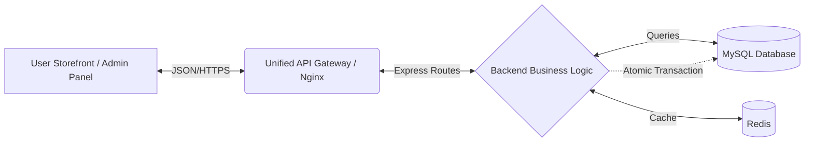

# Project Technical Manifest

## 1. Project Structure & Architecture

### Directory Structure Map
The workspace is organized into a monorepo-style structure separating the Backend API, Documentation, and Frontend assets.

```
/
├── backend/                  # REST API Server (Node.js/Express)
│   ├── config/               # Database & Redis configuration
│   ├── controllers/          # Business Logic (Order, Product, etc.)
│   ├── middleware/           # Security, Auth, Validation (Joi)
│   ├── routes/               # API Endpoint definitions
│   ├── database_schema.sql   # MySQL Schema Definition
│   ├── server.js             # Entry Point & App Configuration
│   └── package.json          # Backend Dependencies
├── eBazer/                   # Frontend / Admin Dashboard Assets
├── src/                      # Frontend Source Code
│   └── api/                  # API Client Integration
│       └── apiClient.js      # Axios Singleton & Interceptors
└── PROJECT_TECHNICAL_MANIFEST.md
```

### System Flow


---

## 2. Technical Stack Specification

### Core Technology
| Component | Technology | Version | Description |
|-----------|------------|---------|-------------|
| **Runtime** | Node.js | v18+ | JavaScript runtime for backend execution. |
| **Framework** | Express.js | ^4.18 | Minimalist web framework for routing. |
| **Database** | MySQL | 8.0 | Relational database storage. |
| **Caching** | Redis | ^5.9 | In-memory key-value store for session/product caching. |

### Security Layer ("The Shield")
Implemented via `backend/middleware/securityConfig.js`:

1.  **Helmet**: Sets secure HTTP headers (e.g., `X-Content-Type-Options`, `X-Frame-Options`).
2.  **Rate Limiting**: Limits requests to 100 per 15 minutes per IP to prevent DDoS/Brute-force.
3.  **CORS**: Configured to allow cross-origin requests from trusted frontends.
4.  **Input Validation**: **Joi** schemas ensure strict payload validation (Types, Required fields, Min/Max values).
5.  **Authentication**: **JWT** (JSON Web Tokens) for stateless user session management.

### Database Architecture
**Schema Models**:
-   **Users**: Stores customer & admin profiles.
-   **Products**: Inventory data with `stock` tracking.
-   **Orders**: Transactional records linked to Users and Coupons.
-   **Coupons**: Discount logic (`percentage`/`fixed`) with usage limits.
-   **Wishlist**: Tracks user-saved products for future purchase.

**Indexing Strategy (High-Performance)**:
-   `idx_sku` (Products): Rapid lookup for Product SKU searches.
-   `idx_user_id` (Orders): Optimized filtering of orders by customer.
-   `idx_category_id`: Fast filtering of products by category.

### Optimization
-   **GZIP Compression**: Enabled via `compression` middleware to reduce payload size by up to 70%.
-   **Atomic Inventory Logic**: Uses `FOR UPDATE` locking in MySQL transactions to prevent overselling ("Race Conditions").
-   **Connection Pooling**: MySQL `createPool` manages DB connections efficiently under load.

---

## 3. API & Connection Documentation

### Unified Client (`apiClient.js`)
The frontend communicates via a singleton `axios` instance configured with:
-   **Base URL**: `import.meta.env.VITE_API_URL` (or localhost fallback).
-   **Interceptors**: Automatically attaches `Authorization: Bearer <token>` to requests and handles global 401 errors.

### Endpoint Catalog

| Service | Method | Endpoint | Description | Payload Structure |
|:---|:---:|:---|:---|:---|
| **Auth** | POST | `/api/auth/login` | User Login | `{ email, password }` |
| **Auth** | POST | `/api/auth/register` | User Registration | `{ name, email, password }` |
| **Products** | GET | `/api/products` | List Products | Query: `?search=...&limit=...` |
| **Products** | GET | `/api/products/:id` | Get Details | - |
| **Orders** | POST | `/api/orders` | Create Order | `{ user_id, total_amount, coupon_code, order_items: [...] }` |
| **Orders** | GET | `/api/orders` | List Orders (Admin) | - |
| **Coupons** | POST | `/api/coupons/verify`| Check Coupon | `{ code }` |
| **Wishlist** | GET | `/api/wishlist` | Get Wishlist | - |
| **Wishlist** | POST | `/api/wishlist` | Add to Wishlist | `{ product_id }` |
| **Wishlist** | DELETE | `/api/wishlist/:id` | Remove Item | - |
| **Dashboard**| GET | `/api/dashboard/stats`| Analytics Data | - |

> **Documentation**: Swagger/OpenAPI docs are available at `http://localhost:5000/api-docs` when the server is running.

---

## 4. Business Logic & Workflow Report

### Dynamic Order Lifecycle
The "Heartbeat" of the e-commerce system follows this strictly validation-heavy path:

1.  **Trigger**: User clicks "Checkout" on Frontend. `apiClient.orders.create()` is called.
2.  **Gatekeeper**: `validate(orderSchemas.create)` middleware checks data integrity (IDs are numbers, amounts > 0).
3.  **Atomic Transaction Start**:
    -   Backend initiates a MySQL Transaction (`START TRANSACTION`).
4.  **Stock Verification & Lock**:
    -   `SELECT stock FROM products ... FOR UPDATE`.
    -   The system locks the specific product rows. No other order can modify this stock until this transaction completes.
    -   **Validation**: checks if `stock >= quantity`. If not, Rollback & Error.
5.  **Coupon Processing** (If applicable):
    -   verifies code validity (Expiry, Usage Limit).
    -   Increments `usage_count`.
6.  **Inventory Decrement**:
    -   `UPDATE products SET stock = stock - ?`.
7.  **Persist**:
    -   `INSERT INTO orders ...`
    -   `INSERT INTO order_items ...`
8.  **Commit**: Transaction ends (`COMMIT`). Data is permanently saved.
9.  **Response**: 201 Created returned to Client.

---

## 5. Deployment & Maintenance Guide

### Environment Variables (.env)
Required configurations for `backend/.env`:

```bash
# Server Configuration
PORT=5000
NODE_ENV=development

# Database (MySQL)
DB_HOST=localhost
DB_USER=root
DB_PASSWORD=
DB_NAME=ebazer_shop
DB_PORT=3306

# Security
JWT_SECRET=your_super_secret_key_here

# Redis (Caching - Optional)
REDIS_HOST=127.0.0.1
REDIS_PORT=6379
```

### Project Health Check
**Commands**:
-   **Start Backend**: `npm start` (Production) or `npm run dev` (Development with nodemon).
-   **Run Tests**: `npm test` (Executes Jest integration tests for Concurrency and Coupons).
-   **Validate DB Connection**: `node backend/scripts/db_health_check.js` (if available) or check startup logs.

### Scalability Roadmap
1.  **Redis Caching**: Currently optional. Implement for `GET /products` to reduce DB load by caching result sets for 60s.
2.  **Payment Gateway**: Integrate **Stripe** or **PayPal** in the `POST /orders` flow before the DB Commit phase.
3.  **CDN**: Offload `/uploads` (User images) to AWS S3 or Cloudinary instead of local disk storage.
